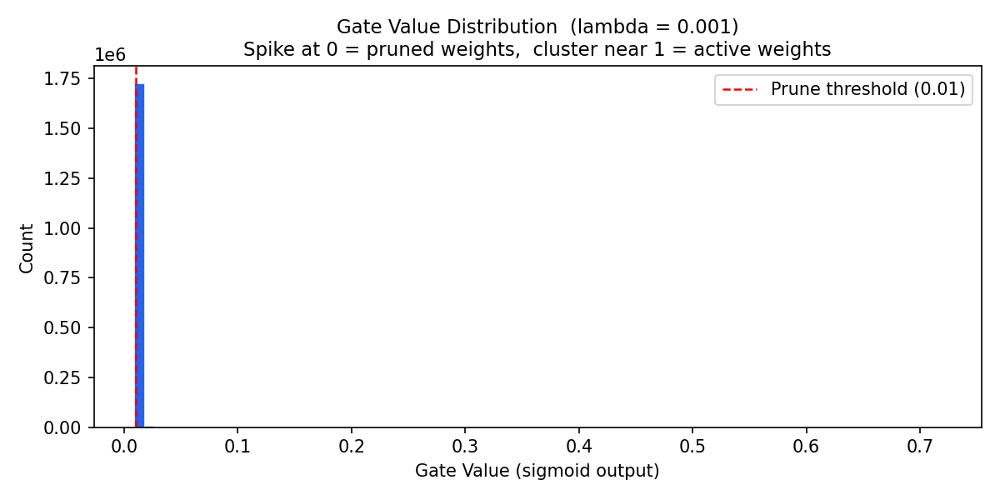

# Self-Pruning Neural Network - Report

This project builds a feedforward neural network that prunes its own weights during training using learnable gates and an L1 sparsity penalty. Tested on CIFAR-10 image classification.

---

## Why L1 Penalty on Sigmoid Gates Encourages Sparsity

Each weight has a gate value between 0 and 1 (sigmoid output). The sparsity loss is just the sum of all these gate values across all PrunableLinear layers. During training this gets added to the cross entropy loss with a lambda multiplier.

The reason L1 works here is because its gradient is always 1, it doesnt matter how small the gate already is, the push toward zero stays constant. With L2 the gradient gets smaller as the value gets smaller so gates shrink but never actually reach zero. L1 is what forces gates all the way to zero which is what we want.

Lambda controls how aggressive this is. Too low and barely anything gets pruned. Too high and the network loses accuracy because even useful weights get gated out.

---

## Results Table

| Lambda | Test Accuracy | Sparsity Level (%) |
|--------|:------------:|:-----------------:|
| 0.0001 | 55.14%       | 42.0%             |
| 0.001  | 50.84%       | 94.8%             |
| 0.01   | 41.65%       | 99.8%             |

**Lambda = 0.0001** - weak penalty so classification loss dominates. Sparsity stayed 0.0% all the way through epoch 19 and only jumped to 42% at the final epoch. Best accuracy of the three runs at 55.14%.

**Lambda = 0.001** - best tradeoff. 94.8% of weights pruned and still 50.84% accuracy. The model threw away almost all its connections and could still classify reasonably well.

**Lambda = 0.01** - most aggressive pruning at 99.8% sparsity but accuracy dropped to 41.65%. The sparsity term dominated the loss completely and the network barely had enough active connections left to learn from.

One thing I noticed across all runs is that sparsity stayed 0.0% for most of training and then jumped sharply in the final epoch. The gates are being pushed down by the L1 penalty throughout training but only cross the 0.01 threshold near the very end.

---

## Gate Value Distribution - Best Model (Lambda = 0.001)

The distribution is clearly bimodal. There is a large spike near 0 representing the 94.8% of weights whose gates were pushed all the way down by the L1 penalty. Then there is a smaller separate cluster of gate values away from 0 representing the connections the network decided to keep because they were actually useful for classification.

There are very few gate values in the middle. The network made clear decisions about which weights to keep and which to remove rather than leaving gates in an ambiguous state. This clean bimodal separation is what successful self-pruning looks like - a large spike at 0 and another cluster of values away from 0.
